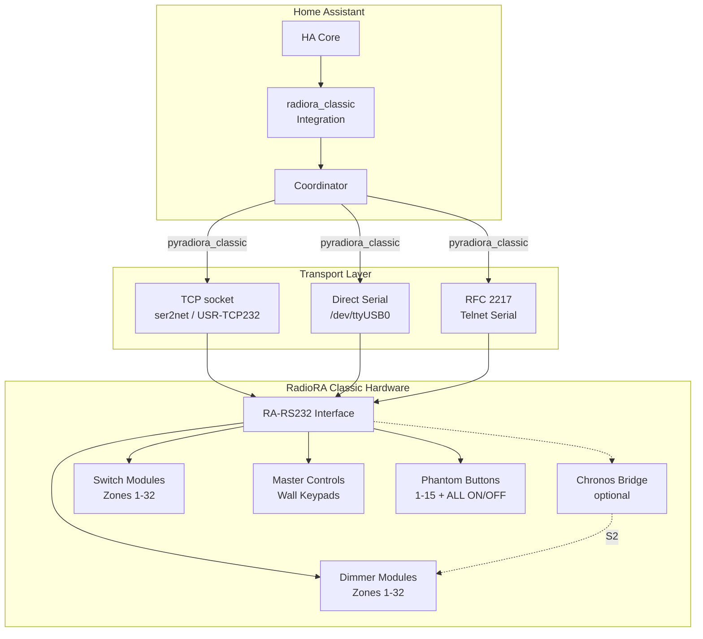
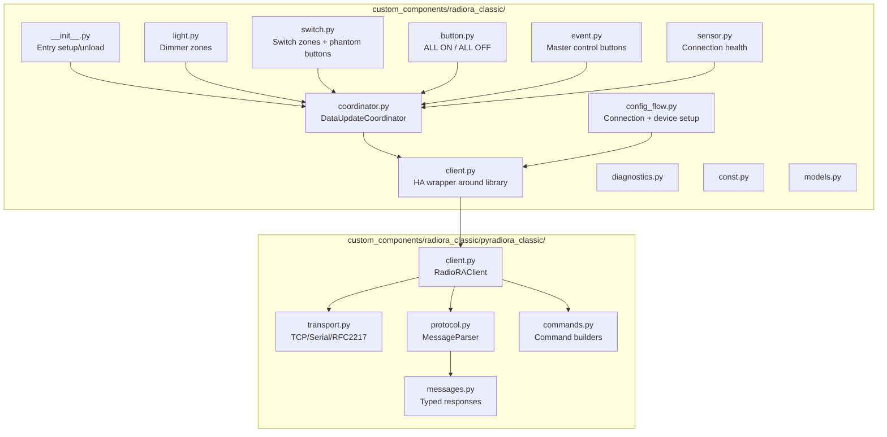

# RadioRA Classic HA Integration - Architecture Plan

## Executive Summary

HACS integration for Lutron RadioRA Classic (v1) lighting control via RS-232. Bundles `pyradiora_classic` library inline (future PyPI dependency). Follows patterns from HWI_HA integration where applicable.

**Domain:** `radiora_classic`  
**IoT Class:** `local_push` (real-time LZC/MBP monitoring + periodic ZMPI polling)  
**Repo:** https://github.com/numericOverflow/lutron_radiora_classic_ha

### HA 2026.x Design Compliance

This integration targets HA 2026.x patterns:

| Pattern | Status | Notes |
|---------|--------|-------|
| `DataUpdateCoordinator` | ✓ Using | Still the recommended pattern; supports push+poll hybrid via `async_set_updated_data()` |
| `ConfigEntry.runtime_data` (typed) | ✓ Using | `type RadioRAConfigEntry = ConfigEntry[RadioRAData]` — replaces deprecated `hass.data[DOMAIN]` |
| `entry.data` / `entry.options` split | ✓ Using | Secrets (URL) in `.data`, devices/settings in `.options` |
| `AddConfigEntryEntitiesCallback` | ✓ Using | New entity setup signature (replaces `AddEntitiesCallback`) |
| Manual `ConfigFlow` (not Schema) | ✓ Using | Required for connection validation + secrets in `.data` |
| `config_entry` param on coordinator | ✓ Using | `super().__init__(hass, _LOGGER, config_entry=entry, ...)` |
| No `show_advanced_options` | ✓ | Deprecated; use `section()` collapsible groups instead |
| Push+Poll hybrid | ✓ Using | Push via `async_set_updated_data()` resets poll timer automatically |

---

## System Context



### Key Interactions

| Direction | What | How |
|-----------|------|-----|
| HA → Hardware | Zone control (SDL/SFA/SSL) | Command via transport |
| HA → Hardware | Phantom button press (BP) | Command via transport |
| Hardware → HA | Zone changed locally (LZC) | Push monitoring |
| Hardware → HA | Master button pressed (MBP) | Push monitoring |
| Hardware → HA | Full zone state (ZMP) | Periodic ZMPI poll |
| Hardware → HA | Phantom LED state (LMP) | On-demand query |

---

## Component Architecture



---

## HA Platform Mapping

| RadioRA Concept       | HA Platform     | Entity Behavior                            |
| --------------------- | --------------- | ------------------------------------------ |
| Zone (1-32, dimmer)   | `light`         | Brightness 0-100, optional fade transition |
| Zone (1-32, on/off)   | `light`         | ColorMode.ONOFF — toggle only, no slider   |
| Phantom button (1-15) | `switch`        | Toggle ON/OFF, LED state = is_on           |
| ALL ON (button 16)    | `button`        | Press action, no state                     |
| ALL OFF (button 17)   | `button`        | Press action, no state                     |
| Master control button | `event`          | Fires `press` event on MBP detection       |
| Connection health     | `sensor`        | Connected/disconnected, reconnect count    |

### Zone Entity Type Decision: Light vs Switch

**Context:** In RadioRA Classic, ALL zones accept dimmer commands at the protocol level (`SDL,zone,level`). A "switch zone" is just a zone with a non-dimmable physical fixture — the protocol is identical. The RA-RS232 interface has no metadata telling us which zones are dimmable vs switched.

#### Options Considered

| Option | Description | Used By |
|--------|-------------|---------|
| **A: All zones as `light`** | Single `LightEntity` class. Dimmable zones get `ColorMode.BRIGHTNESS`, user-flagged on/off-only zones get `ColorMode.ONOFF` | `control4`, `insteon`, `upb`, `qwikswitch` |
| **B: Dimmer→light, Switch→switch** | Two platforms, user declares type in config | Official `lutron`, `lutron_caseta` |
| **C: All zones as `light` with BRIGHTNESS** | Every zone gets a brightness slider since hardware supports it | Technically accurate |

#### Pro/Con Analysis

| Factor | Option A (light + dynamic ColorMode) | Option B (light/switch split) |
|--------|--------------------------------------|-------------------------------|
| Code simplicity | Single entity class ✓ | Two classes to maintain |
| Automation UX | Always `light.turn_on` ✓ | Must know which service to call |
| Voice assistants | "Dim X to 50%" works for all ✓ | Switch zones reject brightness |
| Dashboard | Brightness slider where appropriate ✓ | Switches get toggle card |
| Semantic correctness | "Light" for a exhaust fan feels wrong | Switch + device_class=outlet ✓ |
| Reconfiguration | Change ONOFF↔BRIGHTNESS in options, no entity break ✓ | Platform change = entity recreated |
| HA scenes | Captures brightness level ✓ | Switch only captures on/off |
| Official Lutron precedent | Differs from lutron/caseta | Matches exactly ✓ |

#### Decision: **Option A — All zones as `light` entities**

Rationale:
1. **RadioRA Classic protocol treats all zones identically** — `SDL,zone,level` works on every zone. There is no protocol-level distinction.
2. **No auto-detection** — unlike RadioRA 2 which reports `is_dimmable`, Classic gives us no metadata. Forcing users to classify every zone adds config burden for no hardware benefit.
3. **Non-breaking reconfiguration** — user can toggle a zone between BRIGHTNESS and ONOFF in options without destroying the entity/history.
4. **Default to BRIGHTNESS** since the hardware genuinely supports it. Add optional per-zone `"mode": "onoff"` flag for users who want to suppress the slider (non-dimmable fixtures, fans, etc).

**Implementation:**
```python
# Single class, dynamic ColorMode based on user config
class RadioRALight(CoordinatorEntity, LightEntity):
    if zone_config.mode == "onoff":
        _attr_color_mode = ColorMode.ONOFF
        _attr_supported_color_modes = {ColorMode.ONOFF}
    else:  # default: dimmer
        _attr_color_mode = ColorMode.BRIGHTNESS
        _attr_supported_color_modes = {ColorMode.BRIGHTNESS}
```

**Impact on platform mapping table:** The "Switch zone" row above is removed — all zones become lights. The `switch` platform is now only used for phantom buttons (1-15).

---

## Entity Identification Strategy

**Unique IDs** are stable, based on `controller_id` + zone/button numbers (never change). See detailed pattern below.

**Device names** are user-friendly overrides stored in options. Renaming a device never breaks the unique ID.

#### Naming & Unique ID Pattern (follows HWI_HA)

HWI_HA uses this pattern (confirmed from code):
```python
# Entity naming: entity IS the device (1:1), name comes from DeviceInfo
self._attr_has_entity_name = True
self._attr_name = None  # entity name = device name
self._attr_unique_id = f"homeworks.{controller_id}.light.{self._addr}.v2"

device_info = DeviceInfo(
    identifiers={(DOMAIN, f"{controller_id}.{self._addr}.v2")},
    name=name,                    # ← user-supplied friendly name from config
    manufacturer="Lutron",
    model="HomeWorks Dimmer",
)
if area:
    device_info["suggested_area"] = area  # ← HA auto-assigns to room
```

**Key behaviors:**
- `has_entity_name = True` + `name = None` → entity name derives from device name
- Device name = user-friendly name from config (e.g., "Living Room Overhead")
- User can rename the device in HA UI at any time without breaking unique_id
- `suggested_area` places device in correct room on first creation
- `controller_id` is a user-supplied slug enforced unique across entries (not `entry_id`)

#### Our Adaptation for RadioRA Classic

```python
# unique_id uses controller_id (user slug) + zone number — stable, immutable
self._attr_unique_id = f"radiora_classic.{controller_id}.light.z{zone}"
# For bridged S2: f"radiora_classic.{controller_id}.s2.light.z{zone}"

device_info = DeviceInfo(
    identifiers={(DOMAIN, f"{controller_id}.light.z{zone}")},
    name=zone_config["name"],             # "Living Room Overhead"
    manufacturer="Lutron",
    model="RadioRA Classic Dimmer",       # or "RadioRA Classic Zone"
)
if zone_config.get("area"):
    device_info["suggested_area"] = zone_config["area"]
```

#### Updated Unique ID List

- Light: `radiora_classic.{controller_id}.[s{system}.]light.z{zone}`
- Phantom switch: `radiora_classic.{controller_id}.[s{system}.]phantom.b{button}`
- Button: `radiora_classic.{controller_id}.[s{system}.]button.{all_on|all_off}`
- Event: `radiora_classic.{controller_id}.[s{system}.]master.mc{master}.b{button}`
- Sensor: `radiora_classic.{controller_id}.sensor.connection`

Where:
- `{controller_id}` = user-supplied slug set once during initial config flow (e.g., "basement", "mainfloor"). Stored in `entry.options["controller_id"]`. Enforced unique across all RadioRA Classic entries. **Immutable after creation.**
- `[s{system}.]` = only present for bridged S2 devices. S1 (or non-bridged) omits this segment entirely for backward compatibility.

**Known limitation:** If a user later adds a Chronos bridge to a previously non-bridged system, existing entity unique IDs (without system prefix) will not match the bridged S1 pattern. The integration must be removed and re-added to recreate entities with correct IDs. This scenario is expected to be extremely rare.

**Constraints:**
- `controller_id` is set once during config flow, cannot be changed after (immutable identifier)
- User can rename the device freely in HA UI; that only changes the display name, not the unique_id
- Zone number is the stable hardware address — never changes


---

## Config Entry Data Layout (HA 2026.x compliant)

```python
# entry.data — credentials/connection (secrets)
{
    "url": "socket://192.168.1.50:4999",  # or "/dev/ttyUSB0" or "rfc2217://..."
    "bridged": False,                      # True if Chronos bridge (S1+S2)
}

# entry.options — non-secrets (devices, settings)
{
    "controller_id": "radiora_main",       # slugified, for multi-entry
    "poll_interval": 30,                   # ZMPI heartbeat seconds
    "zones": [
        {
            "zone": 1,
            "name": "Living Room Overhead",
            "mode": "dimmer",              # "dimmer" (default) | "onoff"
            "area": "Living Room",
            # "system": 1,                 # Only present when bridged=True. Valid: 1 (S1), 2 (S2)
            "fade_sec": null,              # null = don't send fade param
        },
        ...
    ],
    "phantom_buttons": [
        {
            "button": 1,
            "name": "Evening Scene",
            "area": "Living Room",
        },
        ...
    ],
    "master_controls": [
        {
            "master_control": 1,
            "button": 3,
            "name": "Kitchen Keypad Top",
            "area": "Kitchen",
        },
        ...
    ],
}
```

**Device naming pattern:** The `"name"` field in each zone/button config becomes `DeviceInfo(name=...)`. With `has_entity_name=True` + `name=None`, the entity's display name IS the device name. User can override in HA UI without affecting unique_id. The `"area"` field maps to `DeviceInfo["suggested_area"]` for automatic room assignment on first creation.

---

## Bundled Library: pyradiora_classic

**Source:** `C:\repos\pyradiora_classic` (not yet on PyPI)  
**Strategy:** Copy the library source into the integration as a sub-package. When it's eventually published to PyPI, delete the bundled copy and add it to `manifest.json` requirements.

### Directory Layout

```
custom_components/radiora_classic/
├── __init__.py
├── config_flow.py
├── coordinator.py
├── client.py                  ← HA wrapper (thin layer over library)
├── light.py
├── switch.py
├── button.py
├── event.py
├── sensor.py
├── diagnostics.py
├── const.py
├── models.py
├── manifest.json
├── strings.json
├── services.yaml
├── icons.json
├── translations/
│   └── en.json
└── pyradiora_classic/         ← BUNDLED LIBRARY (verbatim copy from source)
    ├── __init__.py
    ├── client.py              ← RadioRAClient (async, full-featured)
    ├── client_sync.py         ← RadioRAClientSync (not used by HA)
    ├── commands.py            ← Command string builders
    ├── const.py               ← Protocol constants & enums
    ├── exceptions.py          ← Exception hierarchy
    ├── messages.py            ← Typed response dataclasses
    ├── protocol.py            ← MessageParser
    ├── transport.py           ← AsyncTransport (TCP/Serial/RFC2217)
    ├── transport_sync.py      ← Sync transport (not used by HA)
    └── py.typed
```

### What Gets Copied

The entire `src/pyradiora_classic/` directory from `C:\repos\pyradiora_classic` is copied verbatim into `custom_components/radiora_classic/pyradiora_classic/`. No modifications to the library code.

### Import Pattern

```python
# In custom_components/radiora_classic/client.py (HA wrapper):
from .pyradiora_classic import (
    RadioRAClient,
    RadioRAConnectionError,
    RadioRAConnectionLost,
    RadioRATimeoutError,
    AnyMessage,
    LocalZoneChange,
    ZoneMap,
    LEDMap,
    MasterButtonPress,
    System,
    ZoneState,
    ButtonState,
    MonitorType,
)
```

The key: imports use **relative path** (`.pyradiora_classic`), not the PyPI package name. This is intentional.

### manifest.json (While Bundled)

```json
{
  "domain": "radiora_classic",
  "name": "Lutron RadioRA Classic",
  "codeowners": ["@numericOverflow"],
  "config_flow": true,
  "documentation": "https://github.com/numericOverflow/lutron_radiora_classic_ha",
  "integration_type": "hub",
  "iot_class": "local_push",
  "issue_tracker": "https://github.com/numericOverflow/lutron_radiora_classic_ha/issues",
  "loggers": ["custom_components.radiora_classic"],
  "requirements": ["pyserial>=3.5", "pyserial-asyncio-fast>=0.11"],
  "version": "1.0.0"
}
```

Note: `pyserial` and `pyserial-asyncio-fast` are the library's runtime deps — they must be in `requirements` since they're not bundled. The library itself has no entry in `requirements` because it's bundled.

### Future PyPI Migration (When Published)

When `pyradiora-classic` is on PyPI:

1. **Delete** `custom_components/radiora_classic/pyradiora_classic/` directory
2. **Update** `manifest.json`:
   ```json
   "requirements": ["pyradiora-classic>=1.0.0", "pyserial>=3.5", "pyserial-asyncio-fast>=0.11"]
   ```
3. **Change imports** in `client.py` from relative to absolute:
   ```python
   # BEFORE (bundled):
   from .pyradiora_classic import RadioRAClient, ...
   
   # AFTER (PyPI):
   from pyradiora_classic import RadioRAClient, ...
   ```
   This is a single-line change in one file (`client.py`) because all integration code imports the library through the `client.py` wrapper — no other file touches the library directly.

### Why This Pattern Works

- **Clean separation:** Integration code never imports library internals directly; it goes through `client.py` wrapper. This means the migration to PyPI is a 3-line diff.
- **No namespace conflicts:** Using relative import (`.pyradiora_classic`) means there's no collision if someone also has the PyPI package installed.
- **Testable independently:** The bundled library retains its own test suite in the original repo. Integration tests mock at the `client.py` wrapper boundary.

---

## Next Steps (subsequent design phases)

1. **Phase 2:** Config flow design (connection step → semi-auto zone discovery → manual edit)
2. **Phase 3:** Coordinator + client wrapper detail (state management, callbacks, polling)
3. **Phase 4:** Entity platform implementations (light, switch, button, event, sensor)
4. **Phase 5:** Diagnostics, services, CSV import
5. **Phase 6:** File tree / module skeleton
6. **Phase 7:** Testing harness & validation tests

---

## Open Questions Resolved

| Question         | Decision                                                                                                                                                        |
| ---------------- | --------------------------------------------------------------------------------------------------------------------------------------------------------------- |
| Zone config      | Semi-auto: ZMPI discovers assigned zones, user names each sequentially + CSV batch import                                                                       |
| Phantom buttons  | Switch (1-15) with LED feedback + Button (16/17) for ALL ON/OFF                                                                                                 |
| Bridged support  | Design for it (System param plumbed through) but not primary test target                                                                                        |
| Master controls  | Binary sensors with momentary press detection                                                                                                                   |
| Domain           | `radiora_classic` — acceptable for HACS. Official Lutron integrations use `lutron` (RA2) and `lutron_caseta` (Caseta). Using `radiora_classic` avoids false association with the RA2 `lutron` integration. If HA core ever adds Classic support they'd likely use `lutron_radiora_classic` or fold it into `lutron`, so our name is collision-safe. |
| Connection       | Support all transports (TCP, serial, RFC2217) via URL scheme                                                                                                    |
| Poll interval    | User-configurable in options flow, default 30s. Push monitoring (LZC/MBP/ZMP) is **always active** — polling is just a reconciliation heartbeat. Push data calls `coordinator.async_set_updated_data()` which resets the poll timer, so no redundant polls occur right after a push event. |
| Fade time        | Not sent by default; user can override per-zone in config or via HA `transition` attribute at call time                                                         |
| Library bundling | Copy `pyradiora_classic/` into integration; replace with PyPI dep later                                                                                         |
| CSV export       | Provide a `radiora_classic.export_config` service that dumps current zone/button/master config to CSV. Format matches CSV import so it can be used as backup or to reconfigure a fresh install. Exported via HA service call → returns file download or writes to `/config/` directory. |
