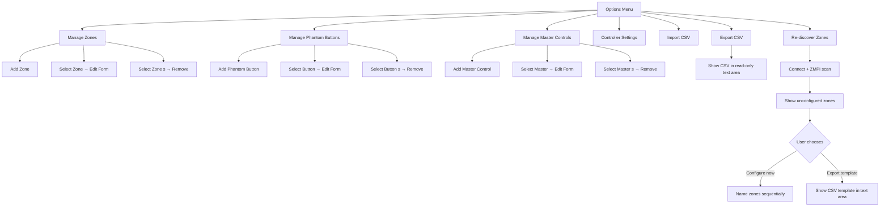
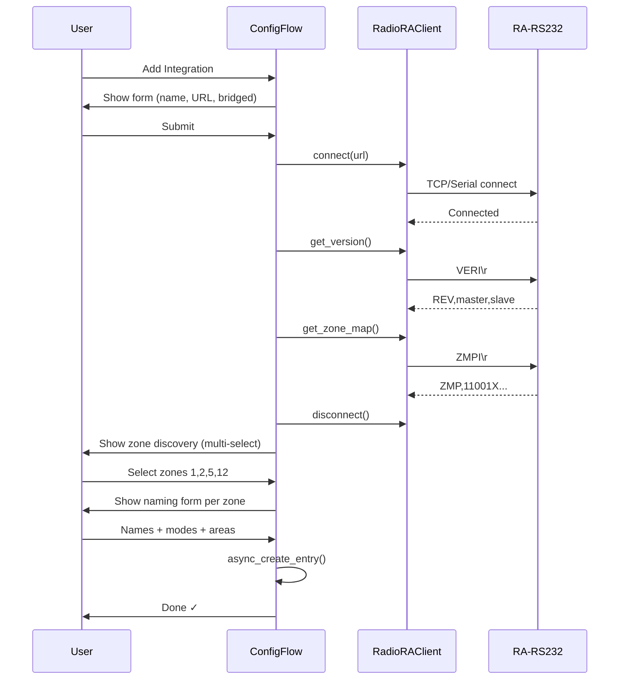

# Phase 2: Config Flow Design

## Overview

The config flow handles two distinct phases:
1. **Initial setup** (ConfigFlow) — connection + controller_id + optional zone discovery
2. **Device management** (OptionsFlow) — add/edit/remove zones, phantom buttons, master controls, CSV import/export, settings

Follows HWI_HA patterns: manual `ConfigFlow` class for initial setup (connection validation + secrets), `SchemaOptionsFlowHandler` with menu-driven CRUD for device management.

---

## Config Flow: Initial Setup

```mermaid
flowchart TD
    START[User adds integration] --> USER_STEP
    USER_STEP[Step: user<br/>- Name/controller_id<br/>- URL<br/>- Bridged yes/no] --> VALIDATE
    VALIDATE{Test connection<br/>via RadioRAClient} -->|Success| DISCOVER
    VALIDATE -->|Fail| USER_STEP
    DISCOVER[Step: discover_zones<br/>Query ZMPI → show assigned zones<br/>User selects which to import] --> NAME_ZONES
    NAME_ZONES[Step: name_zones<br/>For each selected zone:<br/>- Name<br/>- Mode dimmer/onoff<br/>- Area] --> CREATE
    CREATE[async_create_entry<br/>data={url, bridged}<br/>options={controller_id, zones, ...}]
```

### Step: `user`

| Field   | Type            | Required | Notes                                                          |
| ------- | --------------- | -------- | -------------------------------------------------------------- |
| Name    | TextSelector    | Yes      | Friendly name, slugified → `controller_id`                     |
| URL     | TextSelector    | Yes      | `socket://host:port`, `/dev/ttyUSB0`, or `rfc2217://host:port` |
| Bridged | BooleanSelector | No       | Default false. If true, ZMPI returns S1+S2 zone maps           |

**Validation:**
- Slugify name → `controller_id`. Check uniqueness across existing entries.
- Check URL not already configured (same URL = abort `already_configured`).
- Attempt `RadioRAClient(url, bridged=bridged).connect()` + `get_version()` + `disconnect()`.
- On failure: show error `connection_error`.

**On success:** store URL + bridged in flow state, proceed to `discover_zones`.

### Step: `discover_zones`

Connects, sends ZMPI, parses the 32-char zone map. Shows a multi-select of all assigned zones (non-`X` positions).

Display format per zone: `Zone {n} — {'ON' | 'OFF'}` (shows current state from the zone map so user can identify them by toggling lights).

User selects which zones to configure. Unselected zones are skipped (can be added later via options flow).

**Bridged mode:** Shows S1 zones and S2 zones separately (labeled). User selects from both.

### Step: `name_zones`

For each selected zone, show a form with:

| Field | Type | Default | Notes |
|-------|------|---------|-------|
| Name | TextSelector | `"Zone {n}"` | Friendly name |
| Mode | SelectSelector | `"dimmer"` | Options: `dimmer`, `onoff` |
| Area | AreaSelector | (none) | Optional HA area assignment |
| Fade (sec) | NumberSelector | (empty) | Optional. 0-240. Empty = don't send fade param |

**UX optimization:** If many zones selected, show them one at a time (sequential steps) or in a single long form. Given RadioRA Classic max 32 zones, a single form with sections per zone is feasible.

### Entry Creation

```python
data = {
    "url": "socket://192.168.1.50:4999",
    "bridged": False,
}
options = {
    "controller_id": "main_floor",
    "poll_interval": 30,
    "zones": [
        {"zone": 1, "name": "Living Room", "mode": "dimmer", "area": "Living Room", "fade_sec": None},
        {"zone": 5, "name": "Porch", "mode": "onoff", "area": "Exterior", "fade_sec": None},
    ],
    "phantom_buttons": [],
    "master_controls": [],
}
```

---

## Options Flow: Device Management


### Bulk-Edit Design Decision - Batch editing

#### Available Options (ranked by feasibility)

| Option                                 | How                                                                                                       | Pros                                                                                                                               | Cons                                                         |
| -------------------------------------- | --------------------------------------------------------------------------------------------------------- | ---------------------------------------------------------------------------------------------------------------------------------- | ------------------------------------------------------------ |
| **B: CSV round-trip (recommended)**    | Export current config as CSV → user edits in spreadsheet → re-import. "Edit All" = export + import cycle. | True bulk editing in any spreadsheet tool. Handles 32 zones easily. Natural for batch operations. Already planned (import/export). | Requires copy-paste or file transfer. Not "inline" in HA UI. |
| **D: Keep menu CRUD (current design)** | Add/Edit/Remove via menu navigation as designed.                                                          | Simplest to implement. Proven pattern from HWI_HA. Reliable.                                                                       | One-at-a-time only. Tedious for 20+ zones initial setup.     |

#### Decision: **B (CSV round-trip) + D (menu CRUD)**

- **Initial setup:** ZMPI discovery + sequential naming handles first-time config (already designed).
- **Bulk edits after setup:** "Export CSV" → edit externally → "Import CSV" (updates existing, adds new).
- **Single-device tweaks:** Menu CRUD (Add/Edit/Remove) for quick one-off changes.
- **Phantom buttons & master controls** (max 15 and ~10 items): Menu CRUD is sufficient for these small lists.

This gives the best UX without fighting the framework.

### Options Menu (`init`)

```python
OPTIONS_FLOW = {
    "init": SchemaFlowMenuStep([
        "manage_zones",
        "manage_phantom_buttons",
        "manage_master_controls",
        "controller_settings",
        "import_csv",
        "export_csv",
        "rediscover_zones",
    ]),
}
```

### Zone CRUD

**Add Zone:**

| Field | Type | Required | Notes |
|-------|------|----------|-------|
| Zone Number | NumberSelector(1-32) | Yes | Validate not already configured |
| Name | TextSelector | Yes | Friendly name |
| Mode | SelectSelector | Yes | `dimmer` / `onoff` |
| Area | AreaSelector | No | HA area |
| System | SelectSelector | No | Only shown if bridged. `S1` / `S2` |
| Fade (sec) | NumberSelector(0-240) | No | Empty = don't send |

**Edit Zone:** Same fields pre-populated. Zone number immutable (shown but not editable — it's the hardware address).

**Remove Zone:** Multi-select list of configured zones. On removal, clean up entity from entity registry.

### Phantom Button CRUD

**Add Phantom Button:**

| Field | Type | Required | Notes |
|-------|------|----------|-------|
| Button Number | NumberSelector(1-15) | Yes | Validate not already configured |
| Name | TextSelector | Yes | e.g., "Evening Scene" |
| Area | AreaSelector | No | HA area |

**Edit/Remove:** Same pattern as zones.

### Master Control CRUD

**Add Master Control:**

| Field | Type | Required | Notes |
|-------|------|----------|-------|
| Master Control # | NumberSelector | Yes | The physical master control ID |
| Button # | NumberSelector | Yes | Button on that master |
| Name | TextSelector | Yes | e.g., "Kitchen Keypad Top" |
| Area | AreaSelector | No | HA area |

### Controller Settings

| Field         | Type                  | Default | Notes                                                |
| ------------- | --------------------- | ------- | ---------------------------------------------------- |
| Poll Interval | NumberSelector(5-300) | 30      | Seconds between ZMPI polls, 0 disables functionality |


**Connection settings (URL, Bridged)** are in `entry.data` — they cannot be edited from the options flow. Instead, HA's built-in **reconfigure flow** handles this. The user clicks "Reconfigure" on the integration card in Settings → Devices & Services. This triggers `async_step_reconfigure()` which:
1. Shows current URL + bridged pre-populated
2. Validates new connection
3. Calls `async_update_reload_and_abort(data_updates={...})` — updates `entry.data` and reloads the integration

This is the correct HA pattern: options flow = non-secrets, reconfigure flow = connection params.
### Re-discover Zones

Connects to hardware, runs ZMPI, shows zones not yet configured. Same UX as initial `discover_zones` step but within options flow. Allows adding newly-assigned zones without removing existing config.

**CSV export option:** After discovery, offer two paths:
1. **Configure now** — proceed to name zones sequentially (same as initial setup)
	1. Any existing items would be populated with existing values.
2. **Export to CSV** — dump discovered zones as a pre-filled CSV template with zone numbers and ON/OFF state. User fills in names/modes/areas externally, then uses "Import CSV" to bulk-load them.

Template output example:
```csv
type,number,name,mode,area,system,fade_sec
zone,1,,dimmer,,,
zone,2,,dimmer,,,
zone,5,,dimmer,,,
zone,12,,dimmer,,,
```
User fills in `name`, `mode`, `area`, `fade_sec` columns in a spreadsheet, then pastes into "Import CSV". Skips the tedious one-at-a-time naming flow.

---

## CSV Import

Format (matches export):

```csv
type,number,name,mode,area,system,fade_sec
zone,1,Living Room,dimmer,Living Room,0,
zone,5,Porch Light,onoff,Exterior,0,
zone,12,Kitchen,dimmer,Kitchen,0,3
phantom,1,Evening Scene,,Living Room,,
phantom,3,Movie Mode,,Theater,,
master,1:3,Kitchen Keypad Top,,Kitchen,,
```

**Columns:**
- `type`: `zone`, `phantom`, `master`
- `number`: zone number (1-32), button number (1-15), or `master:button` for master controls
- `name`: friendly name
- `mode`: `dimmer` or `onoff` (zones only)
- `area`: HA area name
- `system`: `1`, `2` (zones only, for bridged setups). Optional — omit for non-bridged.
- `fade_sec`: optional fade time (zones only)

**Import behavior:**
- **Atomic:** Parse and validate ALL rows first. If any row has errors, reject the entire import and report all issues. Nothing is saved until all rows pass.
- Duplicates (same zone/button number) update the existing entry rather than creating a second one.
- New entries are appended.
- Validation per row: reject invalid zone numbers (not 1-32), invalid button numbers (not 1-15), unknown types, missing required fields.

**CSV format reference (shown in step description + docs):**

| Column | Required | Valid Values | Notes |
|--------|----------|-------------|-------|
| `type` | Yes | `zone`, `phantom`, `master` | Case-insensitive |
| `number` | Yes | `1`-`32` (zone), `1`-`15` (phantom), `mc:btn` (master) | Master format: `1:3` = master 1 button 3 |
| `name` | Yes | Any text | Friendly display name |
| `mode` | Zones only | `dimmer`, `onoff` | Default: `dimmer` if empty |
| `area` | No | HA area name | Creates area if doesn't exist |
| `system` | No | `1`, `2` | Only for bridged setups. Empty = non-bridged (ignored when `bridged=False`) |
| `fade_sec` | No | `0`-`240` or empty | Empty = don't send fade param |

**Example CSV:**
```csv
type,number,name,mode,area,system,fade_sec
zone,1,Living Room Overhead,dimmer,Living Room,,
zone,2,Living Room Sconces,dimmer,Living Room,,5
zone,5,Porch Light,onoff,Exterior,,
zone,12,Kitchen Under-Cabinet,dimmer,Kitchen,,2
phantom,1,Evening Scene,,Living Room,,
phantom,3,Movie Mode,,Theater,,
master,1:3,Kitchen Keypad Top,,Kitchen,,
master,1:5,Kitchen Keypad Bottom,,Kitchen,,
```

### CSV Export

**Browser file download is NOT natively supported** in HA config flows or service calls. Options researched:

| Approach | Complexity | UX |
|----------|-----------|----|
| Write to `/config/` + persistent notification | Simple | User must access filesystem (Samba/SSH/File Editor) |
| Custom `HomeAssistantView` HTTP endpoint | Medium | Real browser download, but user needs to know the URL |
| Text area in options flow step | Simplest | Copy/paste — no filesystem access needed |

**Decision: Dual approach**

1. **Options flow "Export CSV" step** — shows a read-only `TextSelector(multiline=True)` pre-filled with the CSV content. User copies the text to clipboard and pastes into their spreadsheet. Zero dependencies, works everywhere.

2. **Service `radiora_classic.export_config`** — writes CSV to `{hass.config.path()}/radiora_classic_export.csv` and fires a persistent notification with the path. For users with filesystem access (File Editor add-on, Samba, SSH).

Both produce the same CSV format. The options-flow text area is the primary UX; the service is for automation/scripting use cases.

---

## Connection Testing

```python
async def _try_connection(url: str, bridged: bool) -> VersionInfo:
    """Test connection and return firmware version."""
    from .pyradiora_classic import RadioRAClient, RadioRAConnectionError, RadioRATimeoutError

    client = RadioRAClient(url=url, bridged=bridged)
    try:
        await client.connect()
        version = await client.get_version()
        return version
    finally:
        await client.disconnect()
```

On failure, raises `SchemaFlowError("connection_error")`.

---

## Reconfigure Flow

For changing the URL (e.g., new serial adapter IP) without losing device config:

```python
async def async_step_reconfigure(self, user_input=None) -> ConfigFlowResult:
    """Handle reconfiguration (change URL/bridged without losing devices)."""
    # Shows URL + bridged fields pre-populated from current entry.data
    # Validates connection, updates entry.data, triggers reload
```

---

## Error Handling

| Error Key | When | User Message |
|-----------|------|-------------|
| `connection_error` | Can't connect or no response | "Could not connect to RadioRA RS-232 interface" |
| `already_configured` | Same URL already has an entry | "This device is already configured" |
| `duplicated_controller_id` | Name/slug already in use | "A controller with this name already exists" |
| `duplicated_zone` | Zone number already configured | "This zone is already configured" |
| `duplicated_button` | Phantom button already configured | "This button is already configured" |
| `invalid_url` | URL doesn't parse to valid scheme | "Invalid connection URL" |
| `no_zones_found` | ZMPI returns all X (no assigned zones) | "No assigned zones found on this system" |
| `no_devices_in_csv` | CSV parsed but empty | "No valid devices found in CSV" |
| `csv_too_large` | CSV exceeds size limit | "CSV file is too large" |
| `csv_validation_failed` | One or more rows have errors | Dynamic: shows all row errors |

**CSV error reporting:** Import is atomic (all-or-nothing). On validation failure:
1. All rows are parsed and validated.
2. All row-level errors are collected (not just the first one).
3. The step re-displays with `errors["base"] = "csv_validation_failed"` and `description_placeholders["error_details"]` containing the concatenated error list.
4. In `strings.json`: `"description": "The following errors were found. Fix and re-import:\n\n{error_details}"`

**Error detail format:**
```
Row 3: zone number 45 is out of range (must be 1-32)
Row 7: missing required field 'name'
Row 9: unknown type 'dimm' (expected zone, phantom, or master)
Row 12: fade_sec '999' exceeds maximum (240)
```

HA config flow doesn't support rich structured error display, so this is plain text in the step description. Limited to first 20 errors to avoid UI overflow.

---

## Sequence Diagram: Initial Setup



*Diagram is accurate for the current design. The optional "export template CSV" path during re-discovery (options flow) is a separate flow not shown here — this diagram covers initial setup only.*

---

## Key Differences from HWI_HA

| Aspect | HWI_HA | RadioRA Classic |
|--------|--------|-----------------|
| Connection | host + port + username + password | Single URL string |
| Auth | Login credentials required | No auth (RS-232 has no security) |
| Discovery | None (manual device entry only) | ZMPI auto-discovers assigned zones |
| Address format | Complex `[pp:ll:aa]` notation | Simple integer (zone 1-32) |
| Device types | 7+ types (dimmer, CCO, CCI, keypad, cover, fan, climate) | 3 types (zone, phantom button, master control) |
| Options flow | SchemaOptionsFlowHandler with menu | Same pattern, fewer menus |
| XML import | Full Lutron project XML | N/A (RadioRA Classic has no export tool) |
| CSV import | ✓ | ✓ (same pattern, simpler columns) |
