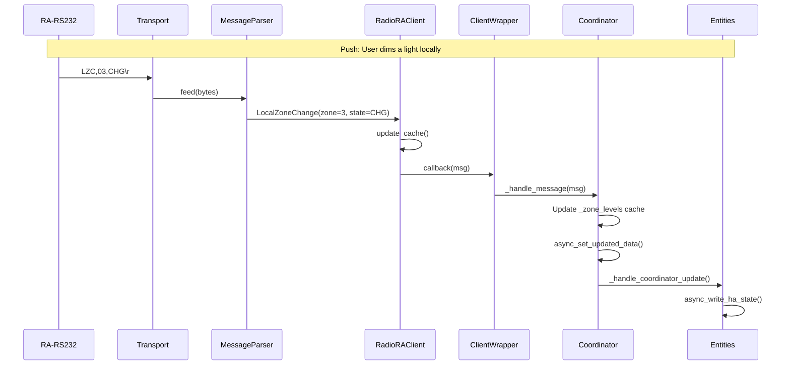
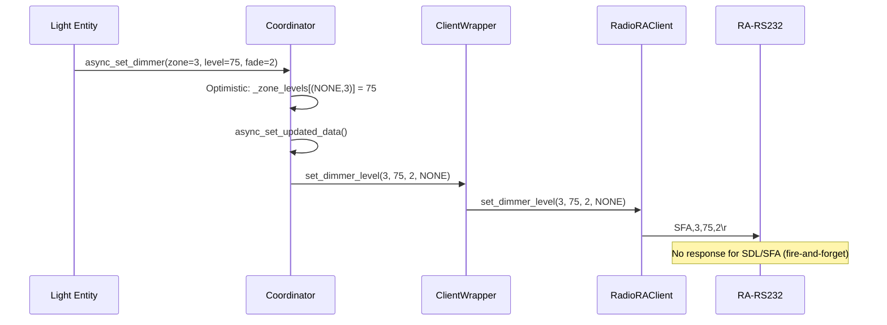

# Phase 3: Coordinator + Client Wrapper

## Section 1: `client.py` — HA Wrapper

Thin adapter between the bundled `pyradiora_classic.RadioRAClient` and the HA coordinator. Only `client.py` instantiates `RadioRAClient` — no other integration file creates client instances. Other files may import *type definitions* (enums, message dataclasses, constants) directly from `.pyradiora_classic` for type annotations and isinstance checks.

### Responsibilities

- Instantiate `RadioRAClient` with URL + bridged flag
- Connect / disconnect lifecycle
- Forward commands from entities (set_dimmer, switch_on/off, button_press)
- Register a message callback that the coordinator provides
- Expose health properties (connected, reconnect_count, etc.)

### Public Interface

```python
class RadioRAClientWrapper:
    """HA-layer wrapper around pyradiora_classic.RadioRAClient."""

    def __init__(
        self,
        url: str,
        bridged: bool,
        message_callback: Callable[[AnyMessage], None],
    ) -> None: ...

    # --- Lifecycle ---
    async def connect(self) -> None: ...
    async def start(self) -> None: ...       # connect + monitoring + initial state query
    async def stop(self) -> None: ...        # stop monitoring + disconnect
    async def start_polling(self, interval: float) -> None: ...
    async def stop_polling(self) -> None: ...

    # --- Commands (called by entities via coordinator) ---
    async def set_dimmer_level(self, zone: int, level: int, fade_sec: int | None, system: System) -> None: ...
    async def switch_on(self, zone: int, system: System) -> None: ...
    async def switch_off(self, zone: int, system: System) -> None: ...
    async def button_press(self, button: int, state: ButtonState, system: System) -> None: ...

    # --- Queries (used by config flow + coordinator) ---
    async def get_zone_map(self) -> list[ZoneMap]: ...
    async def get_led_map(self) -> LEDMap: ...
    async def get_version(self) -> VersionInfo: ...

    # --- State (delegated from library's cache) ---
    @property
    def zone_states(self) -> dict[tuple[System, int], bool | None]: ...
    @property
    def phantom_led_states(self) -> dict[int, bool]: ...
    @property
    def connected(self) -> bool: ...
    @property
    def connected_at(self) -> datetime | None: ...
    @property
    def last_message_at(self) -> datetime | None: ...
    @property
    def reconnect_count(self) -> int: ...
```

### Why a Wrapper?

1. **Single import point** — only `client.py` instantiates `RadioRAClient`. When the library moves to PyPI, one file changes.
2. **Callback bridging** — library uses `Callable[[AnyMessage], None]`; wrapper routes to coordinator's typed handler.
3. **Future-proofing** — can add command queuing, rate limiting, or retry logic without touching entity code.
4. **Testability** — mock at this boundary for integration tests.

### Protocol Command Sequencing (Critical)

Per RadioRA Classic spec (044-038a), the device uses software flow control via the `!` prompt:
- After processing ANY command, the device sends `!\r` to indicate readiness
- Commands sent before the `!` prompt are **silently ignored**
- This is handled at the `pyradiora_classic.RadioRAClient` layer (command lock + prompt gating)
- The HA wrapper does NOT need additional sequencing -- the underlying library guarantees delivery
- Impact: each command takes ~50ms round-trip (prompt wait). Sequential monitoring setup takes ~200ms total on connect. This is acceptable for RS-232 protocol constraints.

---

## Section 2: `coordinator.py` — DataUpdateCoordinator

### Responsibilities

- Owns the `RadioRAClientWrapper` instance
- Manages push+poll hybrid lifecycle
- Maintains state caches that entities read from
- Dispatches push messages to entity updates via `async_set_updated_data()`
- Provides command methods entities call (thin pass-through to client)
- Handles connect/reconnect on first poll and after connection loss

### Class Skeleton

```python
class RadioRACoordinator(DataUpdateCoordinator[dict[str, Any]]):

    def __init__(
        self,
        hass: HomeAssistant,
        config_entry: ConfigEntry,
        url: str,
        bridged: bool,
        controller_id: str,
        poll_interval: int,  # seconds
    ) -> None:
        super().__init__(
            hass, _LOGGER,
            config_entry=config_entry,
            name=f"RadioRA Classic {controller_id}",
            update_interval=timedelta(seconds=poll_interval),
        )
        self._url = url
        self._bridged = bridged
        self._controller_id = controller_id
        self._client = RadioRAClientWrapper(url, bridged, self._handle_message)

        # State caches
        self._zone_levels: dict[tuple[System, int], int] = {}    # (system, zone) -> 0-100
        self._phantom_states: dict[int, bool] = {}               # button -> active
        self._master_events: dict[tuple[int, int], datetime] = {} # (mc, btn) -> last press

    # --- State Snapshot ---
    def _build_state_snapshot(self) -> dict[str, Any]:
        """Build coordinator data dict. Entities use getter methods, but
        async_set_updated_data() requires a non-None payload and triggers
        entity updates via _handle_coordinator_update()."""
        return {
            "zone_levels": dict(self._zone_levels),
            "phantom_states": dict(self._phantom_states),
            "master_events": dict(self._master_events),
        }

    # --- Properties ---
    @property
    def connected(self) -> bool:
        """Whether the RS-232 connection is active."""
        return self._client.connected

    @property
    def reconnect_count(self) -> int:
        """Number of reconnections since entry load."""
        return self._client.reconnect_count

    @property
    def url(self) -> str:
        """Connection URL for diagnostics."""
        return self._url
```

### State Caches

| Cache | Key | Value | Updated By |
|-------|-----|-------|-----------|
| `_zone_levels` | `(System, zone_number)` | `int` 0-100 | LZC push, ZMP poll |
| `_phantom_states` | `button_number` | `bool` | LMP query after ZMP |
| `_master_events` | `(master_control, button)` | `datetime` | MBP push |

### Key Methods

```python
    # --- Entity API ---
    async def async_set_dimmer(self, zone: int, level: int, fade_sec: int | None, system: System) -> None:
        """Set dimmer level. Called by light entities."""
        await self._client.set_dimmer_level(zone, level, fade_sec, system)

    async def async_switch_zone(self, zone: int, on: bool, system: System) -> None:
        """Turn switch zone on/off. Called by light entities in ONOFF mode."""
        if on:
            await self._client.switch_on(zone, system)
        else:
            await self._client.switch_off(zone, system)

    async def async_press_phantom(self, button: int, state: ButtonState, system: System) -> None:
        """Press phantom button. Called by switch entities."""
        await self._client.button_press(button, state, system)

    def get_zone_level(self, zone: int, system: System = System.NONE) -> int:
        """Get cached zone brightness level (0-100)."""
        return self._zone_levels.get((system, zone), 0)

    def get_phantom_state(self, button: int) -> bool:
        """Get cached phantom button LED state."""
        return self._phantom_states.get(button, False)

    def get_master_last_press(self, master: int, button: int) -> datetime | None:
        """Get timestamp of last master button press."""
        return self._master_events.get((master, button))
```

---

## Section 3: Push Message Flow



### Message Routing in `_handle_message`

```python
@callback
def _handle_message(self, msg: AnyMessage) -> None:
    """Route incoming push messages to appropriate cache updates."""
    if isinstance(msg, LocalZoneChange):
        self._handle_zone_change(msg)
    elif isinstance(msg, ZoneMap):
        self._handle_zone_map(msg)
    elif isinstance(msg, LEDMap):
        self._handle_led_map(msg)
    elif isinstance(msg, MasterButtonPress):
        self._handle_master_press(msg)
    # CommandError and UnknownMessage are logged, not dispatched

def _handle_zone_change(self, msg: LocalZoneChange) -> None:
    """LZC push — a zone changed locally."""
    key = (msg.system, msg.zone)
    if msg.state == ZoneState.OFF:
        self._zone_levels[key] = 0
    elif msg.state == ZoneState.ON:
        self._zone_levels[key] = 100  # ON = full brightness
    # CHG = changed but unknown level — keep last-known level (protocol limitation:
    # no command exists to query exact dimmer level). Zone stays marked as ON with
    # its previous brightness. Next HA command will set the accurate level.
    self.async_set_updated_data(self._build_state_snapshot())

def _handle_zone_map(self, msg: ZoneMap) -> None:
    """ZMP response — full 32-zone bitmap. Reconciles all zone states.
    
    ZMP only reports ON/OFF (binary). To avoid clobbering accurate dimmer levels
    from optimistic updates, we only overwrite when:
    - Zone turned OFF (level → 0)
    - Zone is ON but has no tracked level yet (first poll / restart)
    """
    for zone_num in range(1, 33):
        is_on = msg.is_zone_on(zone_num)
        key = (msg.system, zone_num)
        if is_on is None:
            continue  # unassigned zone
        if not is_on:
            self._zone_levels[key] = 0
        elif key not in self._zone_levels or self._zone_levels[key] == 0:
            # Zone is ON but we have no tracked level — assume 100%
            self._zone_levels[key] = 100
        # else: zone is ON and we already have a tracked level — preserve it
    self.async_set_updated_data(self._build_state_snapshot())

def _handle_led_map(self, msg: LEDMap) -> None:
    """LMP response — phantom button LED states."""
    for btn in range(1, 16):
        self._phantom_states[btn] = msg.is_button_active(btn)
    self.async_set_updated_data(self._build_state_snapshot())

def _handle_master_press(self, msg: MasterButtonPress) -> None:
    """MBP push — master control button pressed."""
    key = (msg.master_control, msg.button)
    self._master_events[key] = msg.timestamp
    self.async_set_updated_data(self._build_state_snapshot())
```

### Important: ZMP Only Reports ON/OFF, Not Dimmer Level

The RadioRA Classic ZMP bitmap is binary (1=ON, 0=OFF). It does **not** report the actual dimmer percentage. This means:
- `_zone_levels` preserves optimistic/command-set levels for zones that are ON
- ZMP only overwrites when a zone transitions to OFF or when no level is tracked yet
- For actual dimmer levels, we rely on **optimistic updates** from HA commands sent via `async_set_dimmer()`
- RadioRA Classic protocol has **no command to query a single zone's exact level**

**Consequence:** After HA restart, zones that are ON will show 100% until the user controls them from HA (which sets the accurate optimistic level). Zones controlled only via physical dimmers will show last-known level, which may be stale. This is an accepted protocol limitation.

---

## Section 4: Command Flow + Optimistic Updates

### Entity → Hardware Flow



### Optimistic State Updates

Since SDL/SFA/SSL commands are fire-and-forget (no acknowledgment), we apply **optimistic updates** immediately when the coordinator sends a command:

```python
async def async_set_dimmer(self, zone: int, level: int, fade_sec: int | None, system: System) -> None:
    # Optimistic update — assume command will succeed
    self._zone_levels[(system, zone)] = level
    self.async_set_updated_data(self._build_state_snapshot())
    # Send command (fire-and-forget)
    await self._client.set_dimmer_level(zone, level, fade_sec, system)

async def async_switch_zone(self, zone: int, on: bool, system: System) -> None:
    self._zone_levels[(system, zone)] = 100 if on else 0
    self.async_set_updated_data(self._build_state_snapshot())
    if on:
        await self._client.switch_on(zone, system)
    else:
        await self._client.switch_off(zone, system)
```

The next ZMP poll will reconcile if the command actually failed (hardware didn't respond).

### `fade_sec` Handling

`fade_sec` is **never sent by default**. The RadioRA hardware uses its own system default fade time when the parameter is omitted from SDL commands. We only include it when explicitly specified by:

1. **Per-zone config** — user sets `fade_sec` in zone options (stored in `entry.options["zones"][n]["fade_sec"]`)
2. **HA `transition` attribute** — user passes `transition` in a `light.turn_on` service call

Resolution order in entity's `async_turn_on`:
```python
# 1. Explicit call-time transition takes priority
fade = kwargs.get(ATTR_TRANSITION)
# 2. Fall back to per-zone config (may be None)
if fade is None:
    fade = self._zone_config.get("fade_sec")
# 3. If still None, pass None to coordinator → library omits parameter from command
await self.coordinator.async_set_dimmer(zone, level, fade, system)
```

In the library: `set_dimmer_level(zone, level, fade_sec=None)` → when `fade_sec is None`, builds `SDL,zone,level` (no fade). When specified, builds `SFA,zone,level,fade`.
### Poll Lifecycle (`_async_update_data`)

```python
async def _async_update_data(self) -> dict[str, Any]:
    """Called by DataUpdateCoordinator on each poll interval."""
    # Lazy connect on first call or after disconnect
    if not self._client.connected:
        await self._client.start()

    # Query zone map (reconciliation heartbeat)
    zone_maps = await self._client.get_zone_map()
    for zm in zone_maps:
        self._handle_zone_map(zm)

    # Query phantom LED states
    led_map = await self._client.get_led_map()
    self._handle_led_map(led_map)

    return self._build_state_snapshot()
```

### Shutdown

```python
async def async_shutdown(self) -> None:
    """Called by HA on entry unload or stop."""
    await super().async_shutdown()
    if self._client:
        await self._client.stop()
```

### Pattern Validation vs HWI_HA

Confirmed this follows the same structural pattern as the HWI_HA coordinator:

| Pattern Element | HWI_HA | RadioRA Classic | Match? |
|----------------|--------|-----------------|--------|
| Lazy connect in `_async_update_data` | ✓ `if not connected → _connect_and_subscribe()` | ✓ `if not connected → client.start()` | ✓ |
| Push callback via message handler | ✓ `_handle_message(msg_type, values)` routes by string type | ✓ `_handle_message(msg)` routes by `isinstance` type | ✓ (typed dispatch vs string dispatch — our approach is type-safe since library provides typed dataclasses) |
| Typed handler per message | ✓ `_handle_kls_update`, `_handle_dimmer_update`, `_dispatch_button_event` | ✓ `_handle_zone_change`, `_handle_zone_map`, `_handle_led_map`, `_handle_master_press` | ✓ |
| State caches as dicts | ✓ `_dimmer_states`, `_kls_cache`, `_cci_states` | ✓ `_zone_levels`, `_phantom_states`, `_master_events` | ✓ |
| Entity reads from cache via getter | ✓ `get_dimmer_level()`, `get_cco_state()` | ✓ `get_zone_level()`, `get_phantom_state()` | ✓ |
| Periodic poll as heartbeat | ✓ `_poll_kls_states()` + `_poll_dimmer_states()` every Nth cycle | ✓ `get_zone_map()` + `get_led_map()` each poll cycle | ✓ |
| `async_shutdown` stops client | ✓ `await self._client.stop()` | ✓ same | ✓ |
| Reconnect on connection loss | ✓ Background task `_safe_poll_all_states()` on reconnect event | ✓ Handled by library's auto-reconnect + next poll re-queries state | ✓ (library handles reconnect internally; coordinator reconciles on next poll) |

**One difference justified:** HWI_HA uses string-based message routing (`msg_type == "button_pressed"`) because its protocol library dispatches as `(str, list)`. Our library provides frozen typed dataclasses, so we use `isinstance()` — more Pythonic and type-safe, same structural pattern.